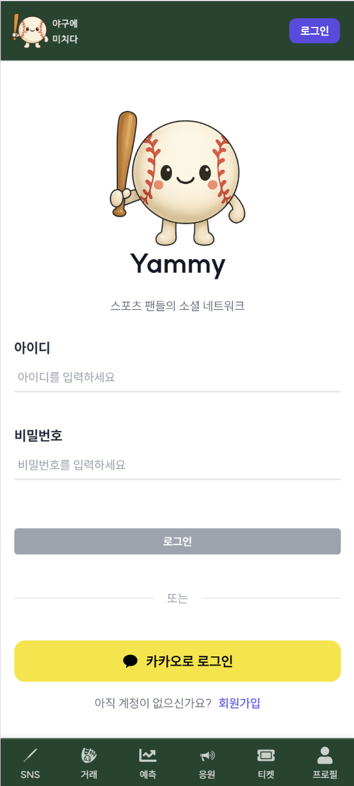
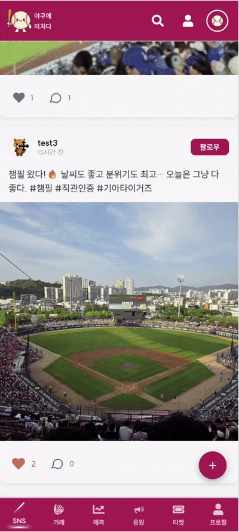
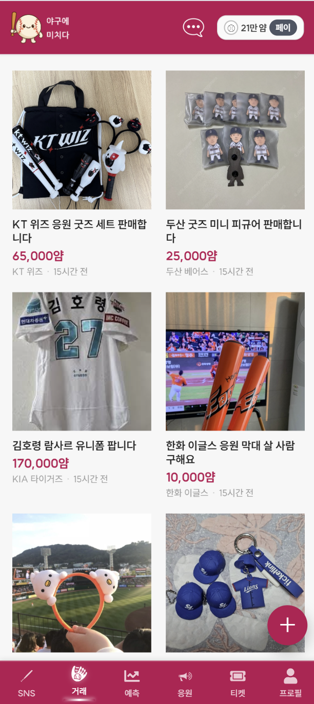
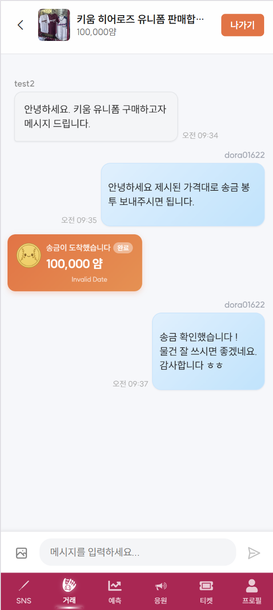
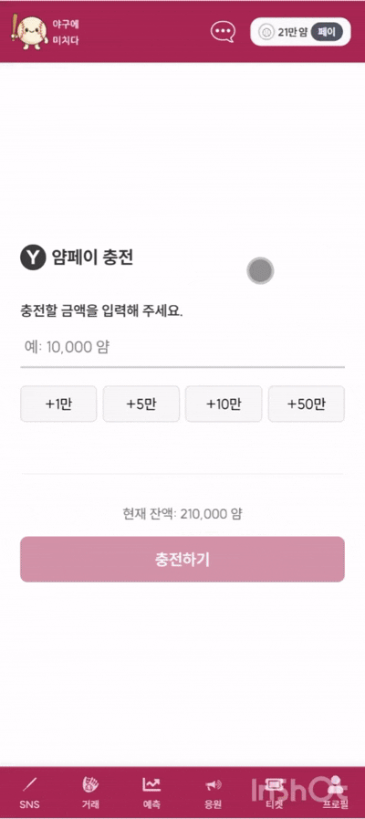
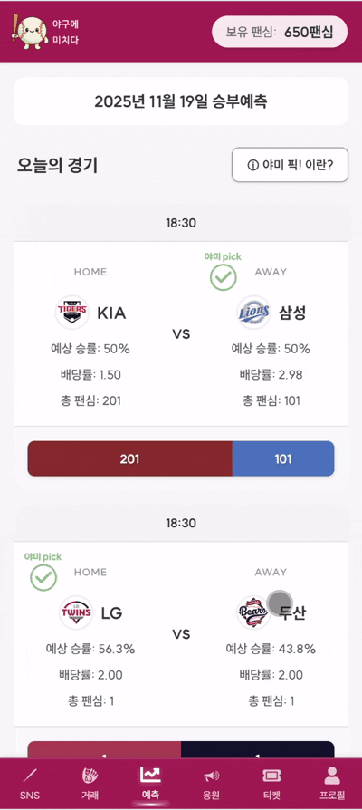
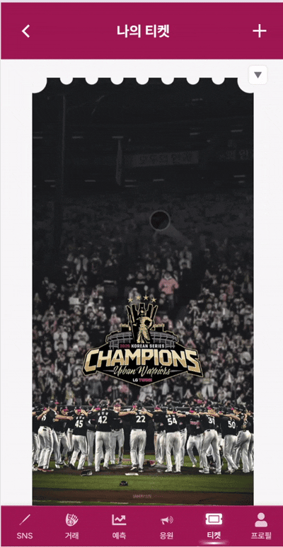
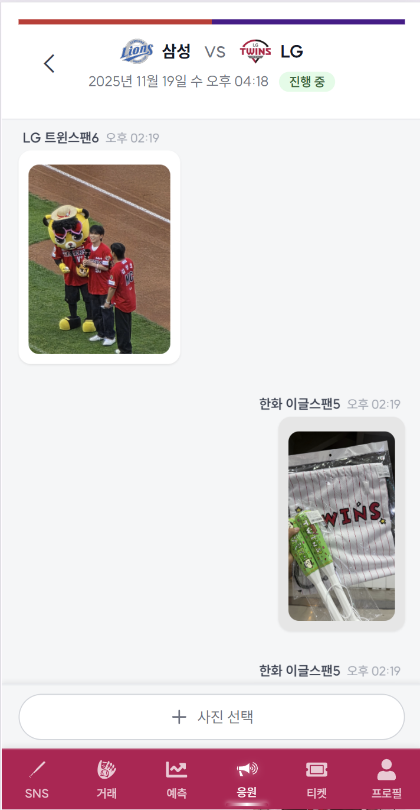
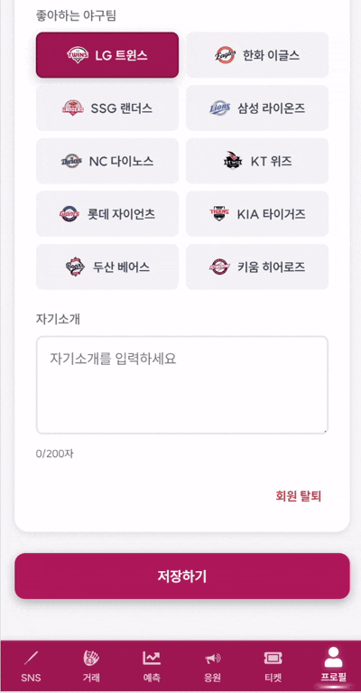

# 야미: 야구에 미치다


## 목차
- [프로젝트 소개](#프로젝트-소개)
- [주요 기능](#주요-기능)
- [기술 스택](#기술-스택)
- [프로젝트 구조](#프로젝트-구조)
- [주요 화면](#주요-화면)
- [API 명세서](#API-명세서)
- [ERD](#erd)
- [아키텍쳐](#아키텍쳐)


## 프로젝트 소개

**야미: 야구에 미치다**는 야구를 사랑하는 팬들을 위한 올인원 플랫폼입니다.
경기 정보 제공부터 AI 기반 승부 예측, 실시간 응원 채팅, 중고 굿즈 거래, NFT 티켓까지 야구 팬들이 필요로 하는 모든 것을 한 곳에서 제공합니다.

## 개발 기간
2025년 10월 ~ 2025년 11월 (7주)

## 주요 기능

### 1. SNS (소셜 네트워크)
- 야구 팬들을 위한 전용 소셜 미디어
- 게시글 작성/수정/삭제 및 이미지 업로드
- 댓글 및 좋아요 기능
- 팔로우/팔로잉 시스템
- 사용자 프로필 및 검색

### 2. 경기 정보 및 AI 예측
- KBO 경기 일정 및 실시간 결과 조회
- **AI 야미픽**: GPT-4 기반 경기 승부 예측
- 포인트를 활용한 베팅 시스템
- 경기별 상세 통계 제공

### 3. 실시간 응원 채팅
- Firebase 기반 실시간 채팅
- 팀별 응원 채팅방
- Kafka를 활용한 안정적인 메시지 처리

### 4. 중고 거래
- 야구 관련 굿즈 중고거래 플랫폼
- **에스크로 시스템**으로 안전거래 보장
- 실시간 채팅으로 거래 협상
- AWS S3를 통한 이미지 업로드

### 5. 포인트 & 결제 시스템
- **토스페이먼츠** 연동 안전결제
- 포인트 충전/사용 관리
- 출금 기능 지원
- 상세한 거래 내역 제공

### 6. NFT 티켓
- 야구 경기 티켓 NFT 발행
- Ethereum Sepolia 네트워크 기반
- IPFS(Pinata)를 통한 메타데이터 저장
- html2canvas로 티켓 이미지 생성

## 기술 스택

### Frontend
| Category  | Tech                  |
| --------- | --------------------- |
| Framework | React 19, Vite        |
| State     | Zustand               |
| Routing   | React Router v7       |
| Network   | Axios (+ Interceptor) |
| Realtime  | Firebase              |
| Styling   | Tailwind CSS          |
| Payment   | TossPayments SDK      |


### Backend
| Category   | Tech                  |
| ---------- | --------------------- |
| Framework  | Spring Boot 3.5       |
| Language   | Java 17               |
| ORM        | JPA, QueryDSL         |
| Security   | Spring Security + JWT |
| DB         | MySQL, Redis          |
| MQ         | Kafka                 |
| Storage    | AWS S3                |
| Blockchain | Web3j                 |
| Payment    | TossPayments API      |
| AI         | OpenAI GPT-4          |


### AI/Data
| Category  | Tech                      |
| --------- | ------------------------- |
| Framework | FastAPI                   |
| Data      | Pandas, Selenium, kbodata |
| Language  | Python 3                  |
| DB        | MySQL Connector           |


### Infrastructure & DevOps
| Category   | Tech            |
| ---------- | --------------- |
| Infra      | AWS EC2         |
| Container  | Docker, Compose |
| CI/CD      | GitLab CI/CD    |
| Registry   | AWS ECR         |
| Web Server | Nginx           |


### External Services
- **Firebase**: 실시간 채팅
- **AWS S3**: 이미지 스토리지
- **Ethereum Sepolia**: NFT 네트워크
- **IPFS (Pinata)**: NFT 메타데이터 저장
- **TossPayments**: 결제 게이트웨이
- **Kakao**: OAuth 소셜 로그인
- **OpenAI**: GPT-4 API


## 프로젝트 구조

<details>
<summary><strong> 보기</strong></summary>

```
S13P31C205/
├── Yammy-FE/               # Frontend (React + Vite)
│   ├── src/
│   │   ├── api/            # API 클라이언트 설정
│   │   ├── auth/           # 인증 (로그인/회원가입)
│   │   ├── chatgames/      # 응원 채팅방
│   │   ├── match/          # 경기 정보
│   │   ├── mypage/         # 마이페이지
│   │   ├── payment/        # 결제 및 포인트
│   │   ├── predict/        # AI 예측 및 베팅
│   │   ├── router/         # 라우팅 설정
│   │   ├── shared/         # 공통 컴포넌트
│   │   ├── sns/            # 소셜 네트워크
│   │   ├── stores/         # 전역 상태 관리 (Zustand)
│   │   ├── ticket/         # NFT 티켓
│   │   ├── useditem/       # 중고거래
│   │   ├── useditemchat/   # 중고거래 채팅
│   │   ├── withdrawal/     # 출금
│   │   └── utils/          # 유틸리티
│   ├── Dockerfile
│   ├── package.json
│   └── vite.config.js
│
├── Yammy-BE/               # Backend (Spring Boot)
│   └── yammy/
│       ├── src/main/
│       │   ├── java/com/ssafy/yammy/
│       │   │   ├── auth/           # 인증/회원
│       │   │   ├── chatgames/      # 채팅방
│       │   │   ├── comment/        # 댓글
│       │   │   ├── config/         # 설정 (Security, Redis, Kafka, S3)
│       │   │   ├── escrow/         # 에스크로
│       │   │   ├── follow/         # 팔로우
│       │   │   ├── kafka/          # Kafka Producer/Consumer
│       │   │   ├── match/          # 경기 정보
│       │   │   ├── nft/            # NFT 발행
│       │   │   ├── payment/        # 결제/포인트
│       │   │   ├── post/           # 게시글
│       │   │   ├── predict/        # 예측/베팅
│       │   │   ├── ticket/         # 티켓 관리
│       │   │   ├── useditemchat/   # 중고거래 채팅
│       │   │   └── withdrawal/     # 출금
│       │   └── resources/
│       │       └── application.yml
│       ├── Dockerfile
│       └── build.gradle
│
└── Yammy-AI/               # AI Server (FastAPI)
    ├── app.py              # FastAPI 앱
    ├── config.py           # MySQL 설정
    ├── controller/
    │   └── baseballdata.py # KBO 데이터 수집
    └── requirements.txt
```

</details>


## 주요 화면

| 로그인 | SNS | 중고거래 |
|--------|--------|--------|
|  |  |  |

| 중고채팅 | 야미페이 | 경기예측 |
|--------|--------|--------|
|  |  |  |

| NFT티켓 | 응원채팅 | 프로필 |
|--------|--------|--------|
|  |  |  |


## API 문서

아래는 카테고리별 API 목록입니다.  
각 섹션을 클릭해 펼쳐서 확인하세요.

---

## 회원 가입 및 로그인
<details>
<summary><strong> Auth API </strong></summary>
<br>

| 기능 | Method | URL | Header | 설명 |
|------|--------|------|---------|--------|
| 📄 로그인 | POST | /api/auth/login | — | 로그인 |
| 📄 로그아웃 | GET | /api/v1/member/logout | Authorization | 로그아웃 |
| 📄 회원 탈퇴 | PATCH | /api/v1/member/withdraw | Authorization | 회원 탈퇴 |
| 📄 회원가입 | POST | /api/auth/signup | — | 회원가입 |
| 📄 토큰 재발급 | POST | /api/auth/refresh | — | Access Token 재발급 |
| 📄 내 정보 조회 | GET | /api/auth/myinfo | Authorization | 내 정보 조회 |
| 📄 비밀번호 변경 | PUT | /api/auth/password | Authorization | 비밀번호 변경 |
| 📄 회원 정보 수정 | PUT | /api/auth/update | Authorization | 프로필 수정 |
| 📄 카카오 로그인 | POST | /api/oauth/kakao | — | Kakao OAuth |
| 📄 카카오 연결 해제 | POST | /api/oauth/kakao/withdraw | — | Kakao 탈퇴 |
| 📄 이메일 인증 요청 | POST | /api/auth/email/send | — | 인증 코드 발송 |
| 📄 이메일 인증 확인 | POST | /api/auth/email/verify | — | 인증 코드 확인 |

</details>

---

## 회원 목록
<details>
<summary><strong> Member API </strong></summary>
<br>

| 기능 | Method | URL | Header | 설명 |
|------|--------|------|---------|--------|
| 📄 전체 회원 목록 조회 | GET | /api/members/all | Authorization | 전체 회원 조회 |
| 📄 회원 검색 | GET | /api/members/search | Authorization | 사용자 검색 |

</details>

---

## SNS
<details>
<summary><strong> POST API</strong></summary>
<br>

| 기능 | Method | URL | Header | 설명 |
|------|--------|---------|--------|--------|
| 게시글 작성 | POST | /api/posts | Authorization | 작성 |
| 이미지 presigned URL | POST | /api/posts/presignedUrls | Authorization | 이미지 업로드 URL |
| 게시글 수정 | PATCH | /api/posts/{postId} | Authorization | 수정 |
| 게시글 삭제 | DELETE | /api/posts/{postId} | Authorization | 삭제 |
| 좋아요 | POST | /api/posts/{postId}/like | Authorization | 좋아요 |
| 전체 조회 | GET | /api/posts/all | — | 전체 SNS |
| 상세 조회 | GET | /api/posts/{postId} | — | 상세 |
| 내 피드 | GET | /api/posts/feed | Authorization | 내 피드 |
| 특정 유저 피드 | GET | /api/posts/user/{userId} | — | 유저 피드 |

</details>

<details>
<summary><strong> Comment API</strong></summary>
<br>

| 기능 | Method | URL | Header | 설명 |
|------|--------|---------|--------|--------|
| 댓글 작성 | POST | /api/comments/post/{postId} | Authorization | 작성 |
| 댓글 수정 | PATCH | /api/comments/{commentId} | Authorization | 수정 |
| 댓글 삭제 | DELETE | /api/comments/{commentId} | Authorization | 삭제 |
| 댓글 조회 | GET | /api/comments/post/{postId} | — | 불러오기 |
| 댓글 좋아요 | POST | /api/comments/{commentId}/like | Authorization | 좋아요 |

</details>

<details>
<summary><strong> Follow API</strong></summary>
<br>

| 기능 | Method | URL | Header | 설명 |
|------|--------|---------|--------|---------|
| 팔로우 | POST | /api/follows/{followingId} | Authorization | 팔로우 |
| 언팔로우 | DELETE | /api/follows/{followingId} | Authorization | 언팔로우 |
| 팔로우 상태 | GET | /api/follows/status/{memberId} | Authorization | 상태 |
| 팔로잉 목록 | GET | /api/follows/following/{memberId} | Authorization | 팔로잉 |
| 팔로워 목록 | GET | /api/follows/followers/{memberId} | Authorization | 팔로워 |

</details>

---

##  중고거래 게시판
<details>
<summary><strong>Used Item API</strong></summary>
<br>

| 기능 | Method | URL | Header | 설명 |
|------|--------|------|---------|--------|
| 📄 중고 게시물 작성 | POST | /api/trades | Authorization | 게시글 작성 |
| 📄 중고 게시물 수정 | PUT | /api/trades/{id} | Authorization | 수정 |
| 📄 중고 게시물 전체 조회 | GET | /api/trades | — | 전체 조회 |
| 📄 중고 게시물 상세 조회 | GET | /api/trades/{id} | — | 단건 조회 |
| 📄 중고 게시물 삭제 | DELETE | /api/trades/{id} | Authorization | 삭제 |
| 📄 중고 게시물 검색 | GET | /api/trades/search | — | 팀/키워드 검색 |
| 📄 Presigned URL 발급 | POST | /api/photos/presignedUrls | Authorization | S3 업로드 URL |
| 📄 업로드 완료 처리 | POST | /api/photos/complete | Authorization | DB 저장 |

</details>

---

## 중고 거래 채팅방
<details>
<summary><strong> Admin API</strong></summary>
<br>

| 기능 | Method | URL | Header | 설명 |
|------|--------|------|---------|--------|
| 📄 채팅방 생성 | POST | /api/admin/chat-rooms | Authorization | 관리자 생성 |
| 📄 채팅방 상태 변경 | PATCH | /api/admin/chat-rooms/{id}/status | Authorization | 상태 변경 |
| 📄 채팅방 삭제 | DELETE | /api/admin/chat-rooms/{id} | Authorization | 방 삭제 |
</details>

<details>
<summary><strong> User API</strong></summary>
<br>

| 기능 | Method | URL | Header | 설명 |
|------|--------|-------|--------|--------|
| 📄 채팅 생성/입장 | POST | /api/useditem/chat/{usedItemId} | Authorization | 생성/입장 |
| 📄 메시지 읽음 처리 | POST | /api/useditem/chat/room/{roomKey}/read | Authorization | 읽음 |
| 📄 메시지 전송 | POST | /api/useditem/chat/room/{roomKey}/messages | Authorization | 전송 |
| 📄 이미지 업로드 | POST | /api/useditem/chat/room/{roomKey}/images | Authorization | 이미지 |
| 📄 전체 unread 조회 | GET | /api/useditem/chat/unread-total | Authorization | unread 수 |
| 📄 채팅방 목록 조회 | GET | /api/useditem/chat/rooms | Authorization | 내 채팅방 |
| 📄 채팅방 상세 조회 | GET | /api/useditem/chat/room/{roomKey} | Authorization | 상세 |
| 📄 채팅방 나가기 | DELETE | /api/useditem/chat/room/{roomKey} | Authorization | 나가기 |

</details>

---

## 야미 페이
<details>
<summary><strong> Pay API</strong></summary>
<br>

| 기능 | Method | URL | Header | 설명 |
|------|--------|-------|--------|--------|
| 📄 결제 확인 | POST | /api/payments/confirm | Authorization | Toss 결제 확인/충전 |

</details>

<details>
<summary><strong> Point API</strong></summary>
<br>

| 기능 | Method | URL | Header | 설명 |
|------|--------|--------|--------|--------|
| 📄 포인트 사용 | POST | /api/points/use | Authorization | 차감 |
| 📄 내 포인트 조회 | GET | /api/points/me | Authorization | 조회 |

</details>

<details>
<summary><strong> Withdraw API</strong></summary>
<br>

| 기능 | Method | URL | Header | 설명 |
|------|--------|--------|--------|--------|
| 📄 출금 요청 | POST | /api/withdraw/request | Authorization | 신청 |
| 📄 출금 내역 조회 | GET | /api/withdraw/history | Authorization | 내역 |

</details>

<details>
<summary><strong> Escrow API</strong></summary>
<br>

| 기능 | Method | URL | Header | 설명 |
|------|--------|---------|--------|--------|
| 📄 송금 요청 | POST | /api/escrow/{roomKey} | Authorization | hold |
| 📄 거래 확정 | POST | /api/escrow/{escrowId}/confirmed | Authorization | release |
| 📄 취소 | POST | /api/escrow/{escrowId}/cancel | Authorization | 환불 |

</details>

---

## 승부 예측 
<details>
<summary><strong> Predict API</strong></summary>
<br>

| 기능 | Method | URL | Header | 설명 |
|------|--------|---------|--------|---------|
| 📄 배팅 요청 | POST | /api/predict/betting | Authorization | 베팅 |
| 📄 경기 정산 | POST | /api/predict/admin/settle | Authorization | 관리자 정산 |
| 📄 내 배팅 조회 | GET | /api/predict/my-bets | Authorization | 조회 |
| 📄 배당률 조회 | GET | /api/predict/odds/{predictedMatchId} | — | 배당률 |
| 📄 포인트 랭킹 | GET | /api/predict/points | Authorization | 순위 |
| 📄 경기 조회 | GET | /api/predict/matches | — | 전체 경기 |
| 📄 GPT 분석 | GET | /api/predict/gpt | — | GPT 예측 |

</details>

---

## 경기 조회
<details>
<summary><strong> Match API</strong></summary>
<br>

| 기능 | Method | URL | Header | 설명 |
|------|--------|---------|--------|--------|
| 📄 최근 경기 조회 | GET | /api/matches | — | 최근 경기 |
| 📄 단일 경기 조회 | GET | /api/matches/{matchcode} | — | 상세 |
| 📄 날짜별 경기 조회 | GET | /api/matches/date/{date} | — | 날짜별 |
| 📄 기간별 경기 조회 | GET | /api/matches/range | — | 일정 범위 |
| 📄 팀별 경기 조회 | GET | /api/matches/team/{team} | — | 팀 경기 |

</details>

---

## 고독한 응원 채팅방
<details>
<summary><strong> Fan Chat API</strong></summary>
<br>

| 기능 | Method | URL | Header | 설명 |
|------|--------|-------|--------|--------|
| 📄 이미지 업로드 | POST | /api/chat/rooms/{roomKey}/images | Authorization | 이미지 |
| 📄 채팅방 목록 조회 | GET | /api/chat/rooms | Authorization | 목록 |
| 📄 채팅방 정보 조회 | GET | /api/chat/rooms/{roomKey} | Authorization | 상세 |

</details>

---

## NFT 직관 티켓
<details>
<summary><strong> Ticket API</strong></summary>
<br>

| 기능 | Method | URL | Header | 설명 |
|------|--------|---------|--------|--------|
| 티켓 발급 | POST | /api/tickets | Authorization | 발급 |
| 이미지 Presigned URL | POST | /api/tickets/presignedUrl | Authorization | 업로드 URL |
| 내 티켓 목록 | GET | /api/tickets | Authorization | 목록 |
| 티켓 상세 | GET | /api/tickets/{ticketId} | Authorization | 상세 |
| 티켓 수정 | PUT | /api/tickets/{ticketId} | Authorization | 수정 |
| 티켓 삭제 | DELETE | /api/tickets/{ticketId} | Authorization | 삭제 |
| 특정 유저 티켓 | GET | /api/tickets/user/{memberId} | Authorization | 타유저 티켓 |
| NFT 민팅 | POST | /api/nft/mint | Authorization | 민팅 |

</details>

## ERD

## 아키텍쳐